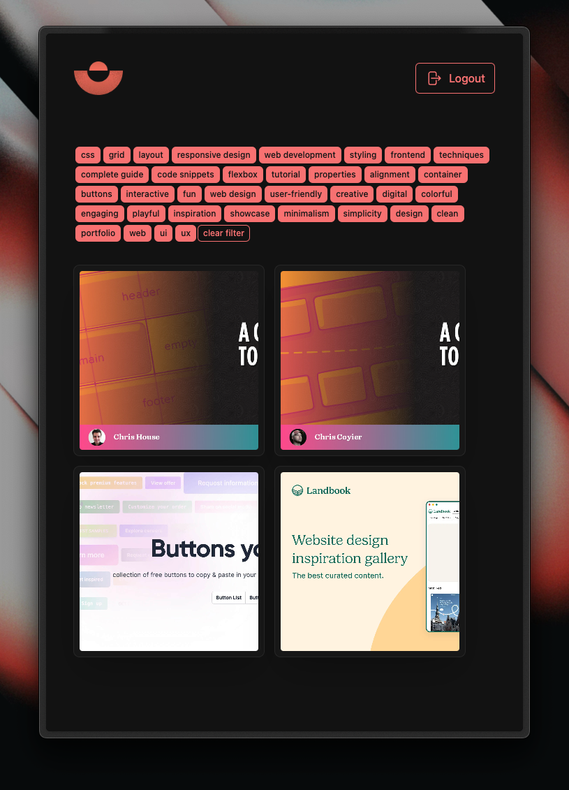

<div align="center">
    
    <h1>The Balance</h1>
    
</div>

WIP - app to bookmark sites and articles to read later.

## running in docker with self-signed certificate

Should be used for local development/testing only.  
Replace necessary values in `certs/server.cnf`.

```bash
  # generate selg-signed certs for local deployment
  ./generate_certs.sh

  # create sqlite.db file -> mount it as volume in docker-compose
  # ./sqlite.db:/app/sqlite.db
  ./create_db.sh

  # build docker image
  pnpm d:b

  # run docker-compose
  docker-compose up -d
```

To access the app in your local network you have to add the self-signed certificate to your trusted certificates.
Variates depending on the OS you are using.

## roadmap

- [ ] categories & tags
  - [ ] auto-tagging & categorization via smart api
- [ ] dockerize to self-host
- [ ] recently saved items
- [ ] categories drag & drop spaces
- [ ] overlay detail view
- [ ] browser extension
  - [ ] use https://wxt.dev/
- [ ] adapt docker-compose for remote deployment
- [ ] create db based on drizzle schema
- [ ] consider switching to caddy or traefik for reverse proxy
- [ ] fix mobile save workflow
- [ ] add filters for tags
